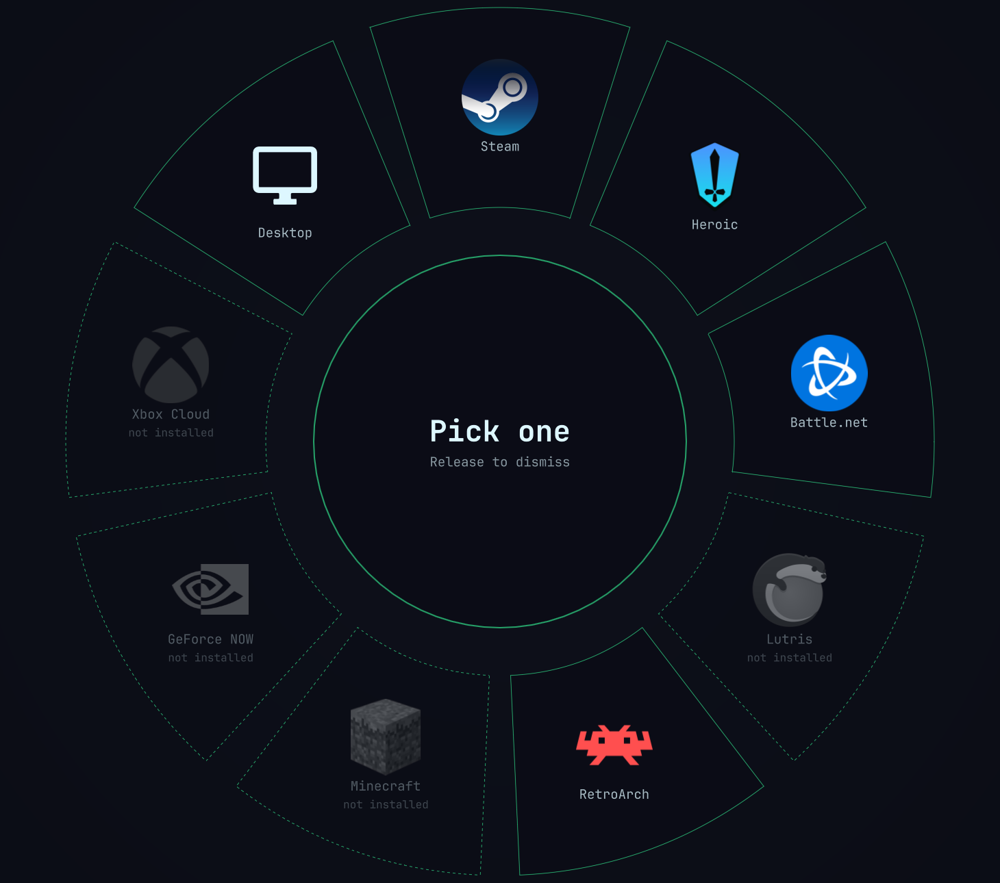

# Gamepad Wheel

An Omarchy 4 plugin. Hold a button on your controller, flick the left stick,
release — the launcher you picked opens in its console/gaming mode. The point
is to get from a controller in your hands to a game running without touching a
keyboard.



## What it does

Holding the summon button (PS / Xbox / Steam by default) puts a donut of arc
wedges in the middle of the screen, one per launcher, laid out clockwise from
the top with each launcher's real icon. The left stick's direction lights a
wedge — it extrudes outward, fills with that launcher's brand color, and the
hub swaps to its logo and name. Releasing the summon button fires it. There is
no confirm step, so the whole gesture is about half a second once you know
where things are.

The ring unfurls clockwise on open, and a soft halo behind the dial picks up
the selected launcher's color.

Everything is sized as a proportion of the shorter screen edge rather than in
fixed pixels, so the wheel fills the display it is on — this is gaming mode, it
should own the screen — and a 13" laptop gets the same proportions as a 27"
monitor instead of a postage stamp in the middle.

Icons resolve in three tiers: the system icon theme first, so installed apps
match the rest of your desktop; then a logo bundled in `media/`; then the
entry's nerd-font glyph. The middle tier matters more than it sounds — an
application that is not installed has no icon-theme entry by definition, so
without bundled art every uninstalled wedge would fall back to a glyph, and
several of those are simply missing from JetBrainsMono Nerd Font.

Circle / B while holding cancels. So does Escape, or a click anywhere outside
the wheel — every cell is also clickable, so the wheel works with a mouse and
is testable with no controller attached at all.

The wheel carries Omarchy's stock gaming roster:

| Entry | Launches |
|---|---|
| Steam | `steam steam://open/bigpicture` — Big Picture |
| Heroic | `heroic --console` — Console Mode |
| Battle.net | `omarchy-launch-battlenet` |
| Lutris | `lutris` |
| RetroArch | `retroarch` |
| Minecraft | `minecraft-launcher` |
| GeForce NOW | `flatpak run com.nvidia.geforcenow` |
| Xbox Cloud | `omarchy-launch-webapp …/play` |
| Desktop | dismiss |

**An entry you have not installed still gets a sector, but it is inert.** It
draws as a fainter card, with a desaturated logo and a "not installed" caption;
the hub reads *Not installed*; and releasing on it does nothing. This wheel
launches games — it does not install software. Install something through
Omarchy's own menu and it comes to life on the next summon, no restart.

Keeping the sector rather than hiding it is deliberate: positions are fixed and
never reorder, because a radial menu is only fast if muscle memory holds. An
entry that appears and disappears as you install things would move everything
after it.

Two of Omarchy's gaming menu entries are deliberately absent. **Xbox
Controllers** installs `xpadneo-dkms`, a driver — there is nothing to launch,
so under the inert rule it could only ever be a permanently dead sector.
**RetroArch Game Launcher** is an interactive tool that prompts for a core and
a ROM path through fuzzy menus to generate a per-game `.desktop` — a keyboard
flow, and precisely what this wheel exists to avoid.

## Nothing persists

Removing this plugin returns the machine to exactly where it started. That is a
design constraint, not a side effect, so it is worth being specific about what
it rules out.

The plugin has two states, and the difference between them is the whole point
of the bar toggle:

- **Passive** (the default, and the state after every shell start). The daemon
  reads the controller and nothing else. Every game and application sees the
  controller exactly as it did before. There is nothing to undo, because
  nothing was changed.
- **Capturing.** Adds `EVIOCGRAB` on the gamepad so the summon button does not
  leak into whatever has focus. The kernel drops the grab when the process's fd
  closes, including on `SIGKILL`, so a crash cannot leave your controller
  captured.

You turn capturing on deliberately, and it is never remembered — `armed` is not
persisted anywhere, so every shell start comes up passive. Input capture is
always something you switched on this session, never something a previous one
left behind.

Beyond that, the plugin does not:

- write to `~/.config/hypr/` or add any keybind (it reads the gamepad directly)
- install a udev rule, a systemd unit, or a modprobe config
- load, bind, or patch a kernel module
- create a uinput device
- change any state inside the controller's firmware

That last one is why the Steam Controller is read the way it is: the plugin
only ever reads the report the controller already sends, and never writes to
it. See Controller support below.

State lives in the plugin directory and in `shell.json`'s plugin settings, both
of which `omarchy plugin remove` cleans up.

## Install

```bash
omarchy plugin add https://github.com/perfektnacht/controller-launcher --enable && omarchy restart shell
```

That clones the repository into `~/.config/omarchy/plugins/`, then asks whether
to place the bar widget left, center, or right, preselected to `right`; `--yes`
takes `right` without asking. The install directory is named from the manifest's
`id`, not from the repository, so it lands at
`~/.config/omarchy/plugins/perfektnacht.controller-launcher` — the shell will
not find the plugin if the two disagree.

The restart is part of the line because entry points are read when the shell
starts: without it the plugin is installed and enabled but nothing appears in
the bar until the next restart, which reads as the install having failed.

To update later:

```bash
omarchy plugin update perfektnacht.controller-launcher
omarchy restart shell
```

`omarchy plugin update` pulls and rescans, but entry points are read when the
shell starts, so the restart is what actually loads changed QML.

The bar widget shows a controller glyph — dim when passive, bright when
capturing. Left click toggles capture; right click opens a menu holding the
controller picker and the wheel itself.

To remove it again:

```bash
omarchy plugin remove perfektnacht.controller-launcher
```

## Configuration

Drop a `~/.config/omarchy/extensions/gamepad-wheel.json` to override entries by
key. It is merged over the defaults, so you only name what you are changing:

```json
{
  "steam": { "sublabel": "Big Picture, 4K" },
  "battlenet": { "when": "false" },
  "moonlight": {
    "icon": "moonlight",
    "glyph": "󰊴",
    "accent": "#8bc34a",
    "label": "Moonlight",
    "sublabel": "Streaming",
    "installed": "command -v moonlight",
    "action": "moonlight",
    "install": "omarchy-launch-floating-terminal-with-presentation 'yay -S moonlight-qt'"
  }
}
```

Wheel order follows key order. The fields:

| Field | Meaning |
|---|---|
| `when` | should this entry appear at all — set `"false"` to hide a default |
| `installed` | shell guard; a non-zero exit renders the entry inert |
| `action` | run when installed; empty just dismisses, which is the `desktop` cell |
| `install` | carried through but unused — reserved, in case install-on-select ever returns behind a flag |
| `accent` | brand color for the wedge, hub, and halo; empty inherits the theme accent |
| `icon` | icon-theme name, tried first |
| `media` | basename in `media/`, defaults to the entry id; `""` skips to the glyph |
| `glyph` | nerd-font fallback |

### The summon button

Summon is on PS / Xbox / Steam by default. Steam grabs that button whenever it
is running, so if the wheel does not come up while Steam has the controller,
move it to one Steam does not take:

```bash
omarchy-shell shell setBarWidget perfektnacht.controller-launcher \
  summonButton '"select"' '{}'
```

Takes effect immediately — the daemon restarts on the spot, no shell restart.
One of `south`, `east`, `north`, `west`, `select`, `start`, `mode`, naming the
physical button by position rather than by the letter printed on it:

| Value | DualSense | Xbox |
|---|---|---|
| `south` | Cross | A |
| `east` | Circle | B |
| `north` | Triangle | Y |
| `west` | Square | X |
| `select` | Create | Back |
| `start` | Options | Start |
| `mode` | PS | Xbox |

`select` is usually the safest, since little else claims it. Anything not on
that list falls back to `mode` rather than leaving you without a wheel. The
setting is stored in `shell.json` alongside the bar widget, so it survives
restarts; remove the key to go back to the default.

The cancel button (Circle / B) is not configurable yet.

### The controller

By default the daemon chooses: the first evdev gamepad it finds, and only if
none answered, a Steam Controller puck. With one controller on the desk there
is nothing to decide.

With more than one, right-click the bar widget. The menu lists every controller
attached right now, marks the one currently driving the wheel, and pins
whichever you pick:

```
Controller
 ● Automatic
 ○ Sony Interactive Entertainment DualSense Wireless Controller  (in use)
 ○ Valve Software Steam Controller Puck
 ─────────────────────────────────────
 Open the wheel
```

A pin is stored in `shell.json` next to `summonButton` and survives restarts,
so a controller you keep on the desk stays chosen. **Automatic** clears it. The
daemon restarts on the spot either way, the same as changing the summon button.

The same list is available from a terminal, which is also how you find a device
path by hand:

```bash
~/.config/omarchy/plugins/perfektnacht.controller-launcher/bin/omarchy-controller-launcherd --list-devices
```

A pinned controller that is switched off simply reads as no controller, rather
than as a connected one that never responds. Nothing falls back to a different
device behind your back: pinning means that controller or none.

## Controller support

**DualSense — works.** The kernel's `playstation` driver exposes it as a
well-behaved evdev gamepad, so there is nothing to reverse engineer. The input
layer is generic evdev, so most gamepads should work; the daemon takes the
first node with a south face button and a left stick.

**Steam Controller — works, without Steam running.** That qualifier is the
whole caveat: while Steam is up, the Steam button belongs to Steam. Pressing it
opens Big Picture Mode, and although the wheel is summoned alongside it, the
stick no longer reaches the wheel — the selection stays at centre and there is
nothing to release onto. Quit Steam and the wheel behaves normally.

The puck (`28de:1304`) is not in `hid-steam`'s device table, which claims only
`1102`, `1142` and `1205`. So all five of its interfaces fall through to
`hid-generic`, the kernel publishes no gamepad, and what you get is the
controller's own firmware emulation — lizard mode, four "Puck Mouse" and four
"Puck Keyboard" nodes.

The controller volunteers its real state regardless: the vendor collection
streams a 53-byte input report `0x42` at about 270Hz whether or not anything
has taken it out of lizard mode. So the daemon opens that hidraw node and
reads, and that is the whole trick. No driver, no Steam, nothing to configure
in Steam, and no udev rule — logind's ACL already grants the seat owner access
to hidraw.

Above all, no writes. Taking the controller out of lizard mode would be a
firmware state change that outlives this process, which is the one thing this
plugin will not do; reading a report the controller was already sending costs
nothing and leaves nothing behind. The `0x01`/`0x02` feature channel that would
do the writing goes untouched.

Arming grabs the puck's own mouse and keyboard nodes, which is the equivalent
of `EVIOCGRAB` on a normal pad: lizard mode originates in firmware, so those
nodes are what would otherwise fling the pointer around and type into whatever
has focus while the wheel is up. The kernel drops those grabs when the process
exits, the same as any other.

The puck has four wireless slots and every one of them advertises the report,
so the daemon opens all of its interfaces and keeps whichever is actually
streaming. A slot with no controller on it stays silent.

Silence is also how the daemon notices a puck being switched off. What
enumerates is the dongle, not the controller, so powering a controller down
leaves the node open and readable — it simply stops delivering. Nothing errors
and nothing reaches end of file. Since a connected puck streams whether or not
it is being touched, two seconds of silence is taken as gone, and the daemon
goes looking again. That is what lets you turn a Steam Controller off, switch a
DualSense on, and have the wheel follow you across without a restart.

## Known limits

- Battle.net has no controller navigation once it opens; it is a Wine window.
  Steam and Heroic both hand off cleanly to full gamepad UIs.
- The wheel launches launchers, not games. Launching a specific game directly
  (`steam://rungameid/…` from the `.acf` files, `heroic://launch/…` from
  Heroic's store JSON) is the obvious next ring and would skip launcher UIs
  entirely.
- The summon button is shared with Steam, which grabs the PS button while it is
  running. On a Steam Controller the wheel still appears, but Big Picture Mode
  opens with it and takes the stick, so no selection can be made. Close Steam to
  use the wheel properly.

## Bundled art

`media/` holds each launcher's logo so uninstalled entries still look like
themselves. Sources:

- `steam`, `minecraft`, `geforce-now`, `xbox-cloud` —
  [homarr-labs/dashboard-icons](https://github.com/homarr-labs/dashboard-icons),
  the same set Omarchy's own Xbox installer pulls from
- `heroic` — the Heroic Games Launcher repo
- `lutris` — the Lutris repo
- `battlenet`, `retroarch` — [simple-icons](https://simpleicons.org), tinted to
  each entry's accent

These are the applications' own marks, included to identify them. They belong
to their respective owners.
